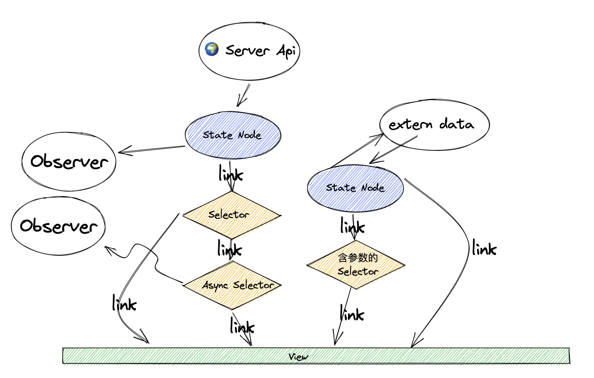

# 数据图中的传递者 — Selector

我们现在已经足够了解 State Node, 开始进入下一个概念 `Selector`, 先看回这张图



首先，先介绍 `Selector`。`Selector` 是一种将数据源以另一种形式往数据图的下游进行传递的机制。那这个机制有什么用吗？

我们正在构建一个 Counter App， 假设我们的每个 Counter 可以被用户设定一个目标，像是每天的锻炼目标等，我们需要一个状态，其代表用户当天是否完成了目标，如果是，我们就将对应 Counter 上加一个横幅以鼓励用户。那么这个状态从哪里来呢，要单独创建一个 State Node? 漏！大漏特漏！这样原本统一的状态就冗余了，而且我们很难保证 count 值和是否达标的状态达成同步 —— `Selector` 闪亮登场！

先看代码，我们可以这样:

```javascript
const counter = state({
  initial: 0,
  actions: {
    increment: () => counter.value += 1,
    decrement: () => counter.value -= 1,
  }
});

// 定义目标状态
const goal = state({
  initial: 0,
  actions: {
    setGoal: (newGoal) => goal.value = Math.max(0, newGoal);
  }
})
// 这里我们引入了带参数的 Action， 你可以这样使用它
const { setGoal } = useActions(goal);
setGoal(20);
// 非常容易，对吧！

// 创建 selector
const isSuccess = selector(({ get }) => {
  const counter = get(counter);
  const goal = get(goal);

  // 当 count 值大于目标值就是成功啦
  return counter >= goal;
});
```

跟 `state` 函数定义创建 State Node 的模版不太相同， `selector` 函数的唯一函数类型的参数就是 `Selector` 本身，`selector` 函数注册一个 `Selector`, 在需要的时候，便嵌入到数据图中。

解析 selector 函数的事稍后，先看如何使用 selector：

```javascript
// 在 Dom 中使用
document.querySelector("#counter-label")?.textContent = `是否成功: ${isSuccess.value}`;
```

和 State Node 的用法差不太多，但显而易见的是，`Selector` 是没有办法再被修改的了。

接下来，我们来说明 `selector` 函数：
